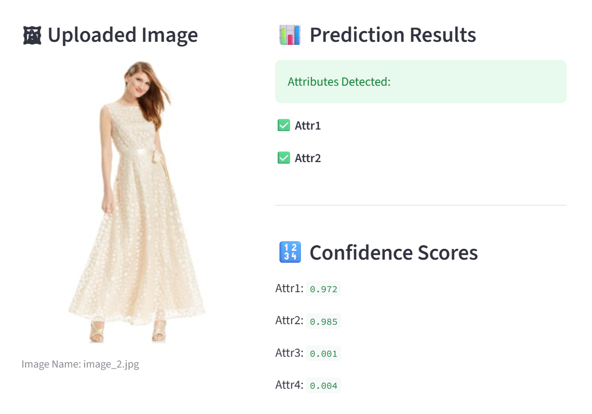
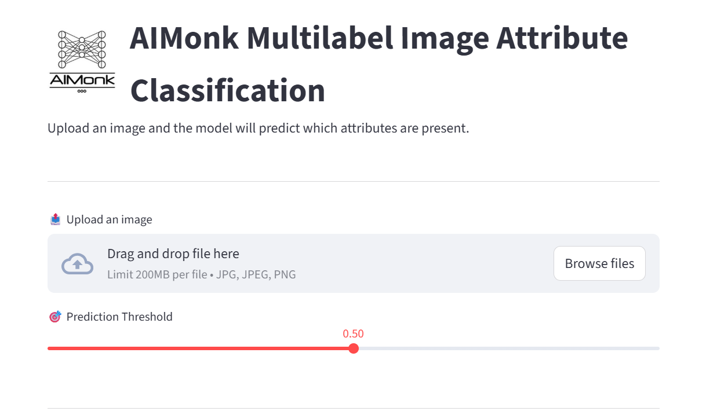

# Aimonk Multilabel Image Attribute Classification

## 📌 Problem Statement

This is a **multilabel image classification problem** where each image can have **multiple attributes simultaneously**.

- Each image is associated with **4 attributes**
- Label values:
  - **1** → Attribute is present
  - **0** → Attribute is absent
  - **NA** → Attribute information is **not available** for that image

The dataset consists of:
- An `images/` directory containing image files
- A `labels.txt` file with the following format:
```text
image_0.jpg 1 NA 0 1
image_1.jpg NA 0 0 0
image_2.jpg 1 1 0 0
```
...


---

## 🎯 Objective

To build a **deep learning–based multilabel classification system** that:

1. Trains a model using images and labels
2. Handles missing labels (`NA`) correctly
3. Tackles dataset imbalance
4. Produces a trained model file
5. Plots training loss
6. Performs inference on new images
7. Provides a Streamlit-based UI for image upload and prediction

---

## ✅ Deliverables Implemented

✔ Training code producing a deep learning model (`model.pth`)  
✔ Loss curve plot  
✔ Provides both notebook-based and UI-based inference  

---

## 🧠 Model Architecture

- **Backbone**: `ResNet18`
- **Pretraining**: ImageNet weights (`IMAGENET1K_V1`)
- **Training Strategy**: Fine-tuning (not training from scratch)
- **Output Layer**: Fully connected layer with 4 outputs (one per attribute)

---

## 🧩 Handling Missing Labels (`NA`)

- `NA` values are **not ignored**
- They are encoded as `-1`
- During training:
  - A **mask** is applied to exclude `NA` values from loss computation
  - Valid labels (`0` or `1`) still contribute to training
- This ensures **maximum data utilization** without introducing noise

---

## ⚖️ Handling Dataset Imbalance

The dataset is **skewed**, with unequal distribution of positive labels per attribute.

### Technique Used:
- **Attribute-wise positive class weighting**
- Computed using:
pos_weight = (total_samples - positive_samples) / positive_samples

- Applied using `BCEWithLogitsLoss(pos_weight=...)`

This penalizes the model more for misclassifying rare attributes.

---

## 🧪 Training Details

- **Framework**: PyTorch
- **Loss Function**: Binary Cross Entropy with Logits
- **Optimizer**: Adam
- **Batch Size**: 16
- **Epochs**: 20
- **Learning Rate**: 1e-4
- **Device**: GPU (if available), else CPU

During training:
- Batch-level progress is shown using `tqdm`
- Epoch time and ETA are displayed
- Training loss is recorded per iteration

---

## 📈 Loss Curve

- X-axis: `iteration_number`
- Y-axis: `training_loss`
- Title: `Aimonk_multilabel_problem`

This plot helps visualize convergence and training stability.

📸 **Screenshot placeholder**:



---

## 🔍 Inference

This project supports **two inference methods**, allowing flexibility for both experimentation and deployment:

### 1.Notebook Inference
- Input: Image path
- Output: List of predicted attributes

Example:
```python
predict("images/image_0.jpg")
```
Output:
```python
Image: image_0.jpg
Attributes present: ['Attr1', 'Attr4']
```

---


## 2.Streamlit Web Application
### A Streamlit-based UI is also provided for easy inference.###

- Features:
- Upload an image

- Adjustable prediction threshold

- Fixed image display size

- Attribute predictions with confidence scores

- Clean, professional layout

- Run the app:
```python
streamlit run app.py
```
- 📸 Screenshot placeholders:



---


## 📁 Project Structure
```text
project/
│
├── images/                # Input images
├── labels.txt             # Image labels
├── model.pth              # Trained model weights
├── streamlit.py           # Streamlit inference app
├── train.ipynb            # Training & inference notebook
├── logo.jpg               # Project logo
├── requirements.txt
└── README.md
```

---


## 📦 Requirements
### Key dependencies:###

- torch

- torchvision

- matplotlib

- pillow

- tqdm

- streamlit

- (Full list available in requirements.txt)


---


## 🏁 Conclusion
### This project successfully implements a robust multilabel image attribute classification system that:###

- Uses transfer learning

- Handles missing labels properly

- Addresses dataset imbalance

- Provides both notebook-based and UI-based inference

- Is modular, clean, and production-ready


---


## 👤 Author
- **Yogesh Sharma**
Machine Learning / Deep Learning Practitioner


---
